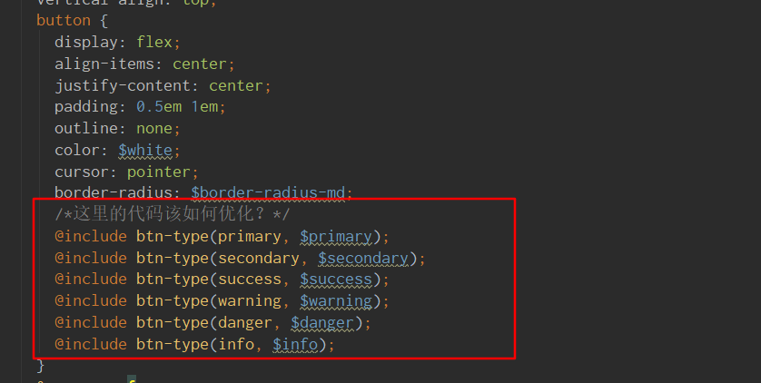
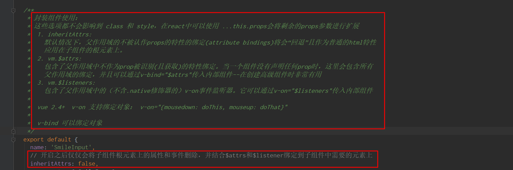
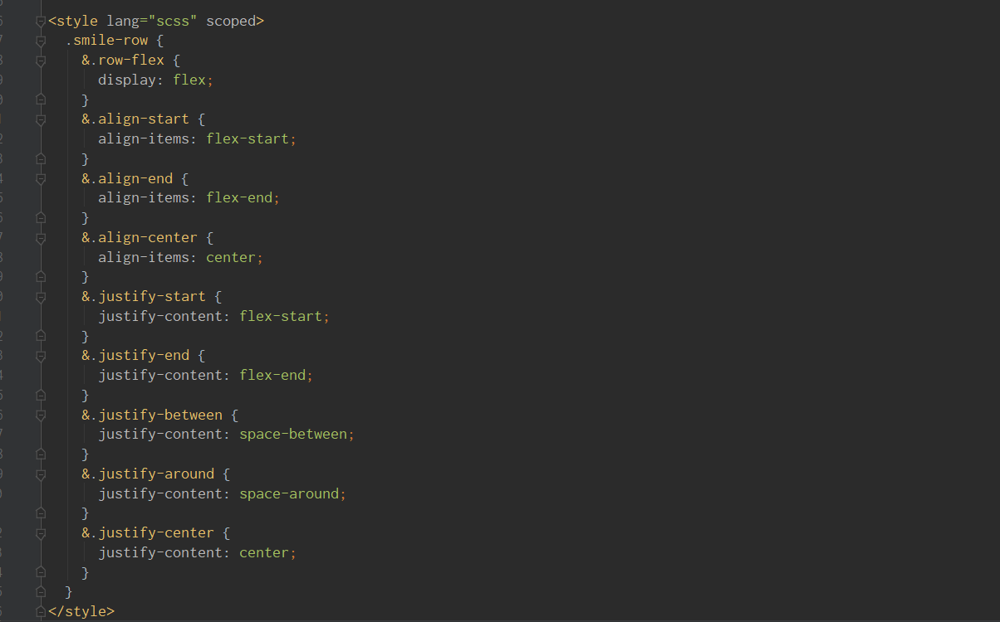

#### 目前问题总结
##### `button`
1. 多种`type`类型的`css`如何优化？
    
    
##### `input`
1. `v-on v-bind $attrs $listeners`的用法尝试，类似于`react`中的属性扩展:
      
    文档链接: [非`Prop`的特性](https://cn.vuejs.org/v2/guide/components-props.html#%E9%9D%9E-Prop-%E7%9A%84%E7%89%B9%E6%80%A7)
2. 错误提示信息展示：可以传入错误提示文字，直接展示到input框右侧
3. `value`属性存在问题：只能通过`v-model`来绑定才能实现各种功能，`element ui`也是这样做的，但是`ant design`和`iview`可以直接绑定`value`来正常使用
4. 允许清空输入内容也是根据`v-model`绑定来实现的，否则会出现问题
5. [自定义组件的`v-model`](https://cn.vuejs.org/v2/guide/components-custom-events.html#%E8%87%AA%E5%AE%9A%E4%B9%89%E7%BB%84%E4%BB%B6%E7%9A%84-v-model)
##### `Grid`
1. `padding`不能设置负值，只能使用负`marin`。[文章推荐](https://stackoverflow.com/questions/4973988/why-does-css-not-support-negative-padding)
2. `slot`父子组件通信： 1. 通过`$children`操作子元素 2. 通过`$parent`操作父元素
3. 对应的`flex`属性开启后`css`写法优化：
    
    
##### `popover`组件
这个组件相对之前的组件来说是比较复杂的，难点重点在于`css`样式的书写，元素的位置获取，以及`js`事件机制的理解

##### `modal`组件
在页面(`body`)出现滚动条的时候，弹出模态框要禁止页面的滚动，关闭模态框恢复页面滚动 
```vue
watch: {
  // 模态框出现后阻止浏览器滚动
  visible (newVal) {
    if (newVal) {
      document.body.classList.add('modal-open');
    } else {
      document.body.classList.remove('modal-open');
    }
  }
},
```

整体上来看，其实这也是一个`css`组件
##### `vuePress`踩坑
* `/`默认代表`/README.md`
* `markdown`中使用`vue`语法，以及在`vue`语法中使用`markdown`代码块
* 加载`favicon`图标
* `code-block`组件过渡动画优化
* 应用级配置：`enhanceApp.js`
* `scss`全局导入在`vuePress`中如何配置
* `icon`组件引入的`svg`由于用到了`BOM`和`DOM`会导致`vuePress`打包失败,使用项目中的`icon`组件不会有问题
* `css`初始化样式引发的问题：css盒模型

#### 需要优化的地方
2. tab组件：a. 动画 b. 插槽 c. 整体功能梳理
#### 之后计划
1. 优化现有代码
2. 重新审视完成组件的样式问题
##### 中级组件
* `carousel`组件
* `collapse`组件
* `popover`组件
* `sticky`组件
* `pagination`分页

##### 高级组件
* `upload`组件
* `table`组件(这里可能要先做好`checkbox`组件)
* `cascader`组件
* `menu`组件

##### 实现困难的组件
* `datePicker`组件
* 高级`table`组件
* `scroll`组件

##### 娱乐组件
* `splitPanel`组件
* 抽奖
* 刮刮卡

##### 使用`demo`
先想一个比较好的样式风格，最好是国外的设计

##### 进阶
尝试写测试用例


